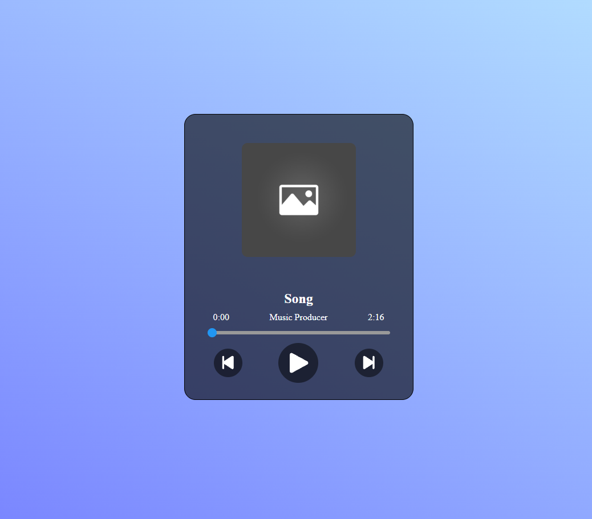

# Music Player

A simple browser-based music player built with HTML, CSS, and JavaScript.

## Run locally

1. Clone this repository.
2. Create an `assets` folder in the project root.
3. Add these files:

   ```text
   assets/
   ├── song.mp3
   └── song-image.jpg
4. Open the project with a local development server, such as VS Code Live Server.
5. Use the playback controls to play your song.

